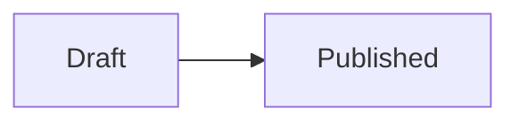

# DevNotes

DevNotes is a developer-focused blog application built with React, TypeScript, Vite, Material UI, Firebase, React Router, and a production Markdown rendering pipeline. It provides an article feed, GitHub-flavored Markdown article pages with syntax-highlighted code blocks, rendered Mermaid diagrams, KaTeX math formulas and automatic table-of-contents navigation, user registration with email verification and approval workflows, protected authoring tools, bookmarks, profile and theme settings, optional analytics consent, and an admin dashboard for managing developer accounts and application settings.

The app can run in two modes:

- Firebase mode, when the required `VITE_FIREBASE_*` environment variables are configured.
- Local emulator mode, when Firebase Authentication and Firestore run through the Firebase Local Emulator Suite.

## Features

- Public blog overview with title/summary/content/author search, dynamic tag filtering, tag counts, a searchable tag popover, featured articles, and paginated older articles.
- Article cards and detail pages with reading time, German date formatting, author metadata, share links, raw Markdown downloads, a navigation-aligned desktop reading layout, a scroll progress indicator, and bookmark toggles for approved users.
- Automatic article table-of-contents navigation generated from Markdown headings, shown as sticky desktop side navigation and as a sticky menu button on narrower viewports.
- Optional closed user group mode that requires visitors to sign in before opening the home feed or article detail pages.
- GitHub-flavored Markdown rendering with `react-markdown`, `remark-gfm`, and `rehype-sanitize`, including stable linkable heading IDs, blockquotes, lists, tables, task lists, inline formatting, inline code, and renderer tests.
- Shiki-powered syntax highlighting for fenced code blocks, rendered as compact editor-style code windows with a title bar, language label, horizontal scrolling, and a copy-to-clipboard button.
- Mermaid diagrams from ```mermaid fenced code blocks, with theme-aware colors, a zoom popup supporting wheel/pinch zoom and drag-to-pan, and SVG downloads. Mermaid is loaded on demand, one chunk per diagram type.
- Math formulas in LaTeX syntax, rendered with KaTeX: `$E = mc^2$` inline and `$$…$$` as display math — on one line, across several lines, or with the fences on their own lines, as on GitHub. Wide formulas scroll horizontally on narrow screens.
- Markdown in blog titles and teaser summaries, rendered consistently in editor previews, article headers, lists, "Meine Beiträge", and bookmarks.
- Context-aware back links: the reading and editing views return to the page the post was opened from ("Zurück zur Merkliste", "Zurück zu meinen Beiträgen", "Zurück zur Übersicht") and keep that origin across editing, publishing, and deletion.
- User registration with username reservation, input validation, strong password rules, Firebase email verification, and pending approval status.
- Protected login flow that blocks pending or rejected users and keeps approved users without verified email from authoring unless they are legacy accounts.
- Approved users can save articles to a private Merkliste and manage saved posts from `/bookmarks`.
- Admin dashboard for reviewing pending, approved, and rejected users, checking email verification status, approving or rejecting registrations, and changing application settings.
- Approved-user routes for creating, editing, deleting, and managing blog posts, including a personal "My Posts" overview with total reading time.
- Private draft workflow with explicit manual saving, publishing, and withdrawal.
- Protected per-post revision history that previews earlier Markdown versions and restores them while preserving the replaced current version.
- Blog editor with comma/semicolon tag entry, adoption of unconfirmed tag input on save, tag sanitization, content length limits, live Markdown preview, live reading-time estimation, and visible bottom-of-screen validation errors on submit.
- Profile page for account details, password updates, theme preferences, accent color selection, and author-name propagation across existing posts.
- Light, dark, and system theme selection from the navbar and profile settings, plus profile-level accent themes for Violett, Blau, Grün, Rose, and Orange.
- Installed app version display in the footer and in the navbar title tooltip.
- Local Firebase emulator mode with Auth and Firestore emulators, Admin SDK bootstrap, post seeding, and a visible emulator indicator.
- Optional Firebase Analytics page tracking that starts only after explicit browser consent.
- German legal pages for Impressum, Datenschutz, and Nutzungsbedingungen.
- Firestore security rules for users, username reservations, application settings, blog posts, immutable ownership fields, dynamic article read protection, and Admin SDK-only cleanup operations.
- Admin SDK maintenance scripts for admin bootstrap, admin/user restore repair, user cleanup, blog post seeding/deletion, and Firestore backup/restore with dry-run and confirmation safeguards.
- Firebase Hosting configuration with SPA rewrites, security headers, and a strict Content Security Policy. Shiki uses its JavaScript regex engine in the browser so syntax highlighting works under this CSP without enabling `wasm-unsafe-eval`.
- Firebase Hosting preview channel deploys through `npm run preview:deploy`, so a build can be reviewed under a temporary URL before going live.
- REST-based Firestore access through the `firebase/firestore/lite` SDK, so every read and write is an independent HTTPS request without a long-lived WebChannel session.
- Installable as a Progressive Web App with a generated web app manifest, a Workbox service worker that precaches the app shell, jump-list shortcuts for writing, "Meine Beiträge", and bookmarks, and a snackbar that offers a reload once a new build is available.

## Tech Stack

- React 19
- TypeScript 6
- Vite 8
- React Router 7
- Material UI 9 with Emotion
- Lucide React icons
- React Markdown, Remark GFM, Remark Math, Rehype Sanitize, Rehype KaTeX
- Shiki syntax highlighting
- Mermaid diagrams
- Firebase Authentication and Cloud Firestore (`firebase/firestore/lite`)
- Vite Plugin PWA with Workbox
- Vitest and Testing Library
- ESLint

Node.js is required in one of the versions declared in `package.json`:

```text
^22.22.2 || ^24.15.0 || >=26.0.0
```

## Project Structure

```text
src/
  components/        Navigation, route guards, analytics consent/tracking, Markdown/Mermaid rendering, and table-of-contents UI
  context/           Authentication, application settings, and theme context providers
  navigation/        Back-navigation origin stack shared by reader, editor, and list pages
  pages/             Route-level pages for blog, auth, admin, profile, and legal views
  services/          Firebase setup, app settings, analytics consent, auth workflow, tag input, and blog data access
  theme/             Material UI theme configuration
  __tests__/         Service, restore utility, search/filter, analytics, back-navigation, Firestore transport, and Markdown renderer tests
scripts/             Admin/user repair, backup/restore, user cleanup, post maintenance, deploy, and Firebase CLI helpers
docs/                Design specs and implementation plans
public/              Favicon and the PWA icon set generated from it
firestore.rules      Cloud Firestore security rules
firebase.json        Firebase Hosting and Firestore configuration
vite.config.ts       Vite build configuration including manual vendor chunking and the PWA plugin
```

## Getting Started

Install dependencies:

```bash
npm install
```

For local development, start the Firebase emulators first:

```bash
npm run emulators
```

Then start Vite in emulator mode from a second terminal:

```bash
npm run dev:emulator
```

Bootstrap the local admin account once:

```bash
npm run emulator:bootstrap-admin
```

The default local admin credentials are:

```text
Email: admin@example.local
Password: LocalAdmin123!
```

The app is served by Vite, usually at:

```text
http://localhost:5173/
```

The Firebase Emulator UI is available at:

```text
http://localhost:4000/
```

Use the regular development server only when `.env` contains a real Firebase web app configuration:

```bash
npm run dev
```

Build for production:

```bash
npm run build
```

Preview the production build locally:

```bash
npm run preview
```

Run tests:

```bash
npm test
```

Run linting:

```bash
npm run lint
```

Remove build and tool artifacts (`dist/`, `coverage/`, TypeScript build info and the Vite/Vitest cache under `node_modules/`, the Firebase Hosting deploy cache and emulator `*-debug.log` files):

```bash
npm run clean
```

`npm run clean:emulator-data` additionally deletes the persisted local emulator database in `.firebase/emulator-data`; it is kept separate because it discards local development data. Reinstall dependencies with `npm ci` if `node_modules/` itself should be rebuilt.

Build and deploy to Firebase Hosting:

```bash
npm run deploy
```

Build and publish to a Firebase Hosting preview channel instead of the live site:

```bash
npm run preview:deploy
```

Deploy only Firestore rules and indexes:

```bash
npm run deploy:rules
```

## Scripts

Common local development commands:

```bash
npm run emulators                 # Start Firebase Auth and Firestore emulators
npm run dev:emulator              # Start Vite connected to the local emulators
npm run emulator:bootstrap-admin  # Create or repair the local admin account
npm run emulator:seed             # Seed example posts into the Firestore emulator
npm run emulator:delete-posts     # Delete all posts from the Firestore emulator
npm run emulator:smoke-blog-workflow # Verify post and revision writes against running emulators
```

Common Firebase project maintenance commands:

```bash
npm run bootstrap:admin
npm run restore:admin          # alias: npm run admin:repair
npm run restore:user           # alias: npm run user:repair
npm run user:delete
npm run posts:seed -- --target firestore
npm run posts:delete -- --target firestore --yes
npm run blogs:migrate-workflow -- --dry-run
npm run blogs:migrate-workflow -- --yes
npm run firestore:backup
npm run firestore:restore
npm run icons:generate         # Re-render the PWA icons from public/favicon.svg
```

Quality and release commands:

```bash
npm run lint
npm run test
npm run build
npm run preview           # Serve the local production build
npm run clean             # Remove build and tool artifacts
npm run preview:deploy    # Build and publish to a Hosting preview channel
npm run deploy            # Build and deploy to Firebase Hosting
npm run deploy:rules      # Deploy Firestore rules and indexes only
```

`npm run deploy`, `npm run preview:deploy`, and `npm run deploy:rules` go through `scripts/firebase-cli-project.mjs`, which resolves the Firebase project id from `FIREBASE_PROJECT_ID` or `VITE_FIREBASE_PROJECT_ID` (also read from `.env`) and passes it to the Firebase CLI as `--project`. This avoids deploying to whatever project the CLI happens to have active.

## Running Against Firebase

`npm run dev` connects to the Firebase project described by `.env`. `npm run dev:emulator` ignores the cloud project endpoints and connects the browser SDK to local emulator hosts instead. Production builds must not enable `VITE_USE_FIREBASE_EMULATOR`.

## Initial Admin Bootstrap

Do not create or seed admin credentials in the browser client. A public first-run setup screen would let the first visitor claim the administrator account, so DevNotes uses a local Firebase Admin SDK bootstrap script instead.

The script creates or updates the admin profile in Firebase Auth and Firestore without storing a password. It generates a Firebase password reset link that the admin uses to set the initial password; the link is only printed when explicitly requested.

Prerequisites:

- A Firebase service account JSON file, kept outside version control.
- `GOOGLE_APPLICATION_CREDENTIALS` pointing to that service account file, or `FIREBASE_SERVICE_ACCOUNT_JSON` containing the full service account JSON.
- `ADMIN_EMAIL` set to the admin's email address.
- Optional `ADMIN_USERNAME`, `ADMIN_FIRST_NAME`, `ADMIN_LAST_NAME`, `FIREBASE_PROJECT_ID`, and `APP_URL`.
- Optional `PRINT_ADMIN_RESET_LINK=1` when you explicitly want the generated reset link printed in a trusted local terminal.

Example:

```bash
GOOGLE_APPLICATION_CREDENTIALS=./firebase-service-account.json \
ADMIN_EMAIL=admin@example.com \
ADMIN_USERNAME=admin \
APP_URL=https://your-domain.example \
PRINT_ADMIN_RESET_LINK=1 \
npm run bootstrap:admin
```

The generated reset link is sensitive. By default the script creates the link but does not print it, which protects CI logs and shared terminals. Use `PRINT_ADMIN_RESET_LINK=1` only in a trusted local terminal, use the link once, then discard it.

If admin credentials are missing, the script prints a setup checklist instead of a stack trace. For local development, the recommended setup is a service account file referenced through `GOOGLE_APPLICATION_CREDENTIALS`.

### Local Firebase Emulator

For local development without touching a cloud Firebase project, run Firebase Auth and Firestore through the Local Emulator Suite:

```bash
npm run emulators
```

In a second terminal, start Vite in emulator mode:

```bash
npm run dev:emulator
```

The app uses project ID `devnotes-local`, Auth at `127.0.0.1:9099`, Firestore at `127.0.0.1:8080`, and the Firebase Emulator UI at:

```text
http://localhost:4000/
```

Bootstrap a local admin account into the emulators:

```bash
npm run emulator:bootstrap-admin
```

By default this creates or updates:

- Email: `admin@example.local`
- Username: `admin`
- Password: `LocalAdmin123!`

Override those values with `ADMIN_EMAIL`, `ADMIN_USERNAME`, `ADMIN_PASSWORD`, `ADMIN_FIRST_NAME`, and `ADMIN_LAST_NAME`.

Use the email address to sign in. Username login is not supported in the Firebase-backed app path; the username is used for author identity, URLs, and ownership checks.

While emulator mode is active in development, the navbar displays a visible `FIREBASE EMULATOR` indicator so local emulator data is not confused with production Firebase data. Emulator data is imported from and exported to `.firebase/emulator-data`, which is ignored by git.

## Authoring Workflow

Approved users can create posts at `/write`. A post belongs to the user whose immutable `username` matches the post's `authorUsername`; new posts do not store the Firebase Auth UID as ownership data. That author and admins can edit posts from the article detail page, and can permanently delete posts after confirming the delete dialog. Admins can also reassign a post to another active author from the edit form; orphaned author usernames remain visible until reassigned.

The editor supports:

- Title, summary, Markdown content, and at least one tag. Titles and summaries support Markdown too.
- Adding multiple tags at once with commas or semicolons. Text left in the tag field is adopted as a tag when the post is saved, published, or stored as a draft, so nothing is silently dropped when the input was not confirmed with Enter or the plus button.
- Editor and preview tabs using the same GitHub-flavored Markdown renderer as the public article page.
- Live word count and estimated reading time.
- Immediate validation feedback in a snackbar near the submit action, while keeping the persistent alert at the top of the form.
- Saving incomplete work as a private draft and publishing or withdrawing it explicitly.
- A revision browser with rendered Markdown previews and restoration; every manual update stores the previously current version first.

### Back Navigation

The back link at the top of the reading and editing views returns to the page the post was opened from and names it accordingly: "Zurück zur Merkliste" from `/bookmarks`, "Zurück zu meinen Beiträgen" from `/my-posts`, "Zurück zur Übersicht" from the home feed. "Abbrechen" in the editor and in the "Neuer Beitrag" form follows the same target, and "Beitrag löschen" routes to a list the deleted post is gone from.

The origin survives multiple steps, so opening an article from the bookmarks page, editing it, and publishing it still leaves "Zurück zur Merkliste" on the article. Direct links, shared links, and reloads fall back to the previous behaviour: drafts lead to "Meine Beiträge", published posts to the overview. The browser's back button is unaffected.

Internally the origin travels as a list of keys in the router state (`src/navigation/backNavigation.ts`) rather than through `navigate(-1)`, because a history entry carries no label to display and does not point at the right page for direct entries or `replace` navigations. Because router state can be tampered with through the history API, it is strictly validated on read and invalid data silently falls back to the default target.

### Blog Workflow Migration

Version 1.1.0 adds required `status`, `updatedAt`, and `publishedAt` fields to blog documents. Existing Firebase projects must migrate current posts before deploying the new rules and client:

```bash
npm run blogs:migrate-workflow -- --dry-run
npm run blogs:migrate-workflow -- --yes
npm run deploy:rules
```

The migration treats existing posts as published and normalizes legacy string timestamps to Firestore timestamps. Back up Firestore before applying it in production.

## Markdown and Code Blocks

Article content is rendered with `react-markdown`, `remark-gfm`, and `rehype-sanitize` instead of a custom Markdown parser. This gives DevNotes CommonMark-compatible parsing plus GitHub-flavored Markdown features such as tables, task lists, strikethrough, and autolinks.

Markdown headings receive stable linkable IDs. The same heading extraction is used by the renderer and the article table of contents, so generated links stay aligned with the rendered content, including duplicate headings, German umlauts, Setext headings, and fenced code blocks that contain Markdown-looking text.

On article detail pages with at least two headings, DevNotes automatically builds a table of contents from headings up to level 4. On desktop it appears as sticky side navigation next to the article. On narrower screens the same navigation is available through a sticky "Inhaltsverzeichnis" menu button so long articles remain navigable without a permanent sidebar.

Fenced code blocks are highlighted with Shiki. The renderer:

- Supports all Shiki language exports through lazy-loaded language chunks and gracefully falls back to plain text for unknown language labels.
- Uses Shiki's JavaScript regex engine in the browser to remain compatible with the Firebase Hosting Content Security Policy.
- Renders each code block as an editor-style window with a language title bar and scrollable body.
- Includes a copy button that copies the raw fenced code to the clipboard.

Inline code is styled separately from fenced code blocks and remains safe React output rather than injected HTML.

### Mermaid Diagrams

Fenced code blocks marked as `mermaid` are rendered as diagrams, both on article detail pages and in the create/edit previews:

````markdown

````

The diagram support includes:

- A dedicated color palette per theme mode for nodes, subgraphs, edges, and labels, instead of the low-contrast Mermaid defaults.
- Inline HTML in labels, so `<b>` and `<i>` render as bold and italic text.
- A zoom popup with mouse-wheel and trackpad zooming up to 800%, two-finger pinch zoom on touch devices, drag-to-pan navigation, a zoom percentage display, fit-to-view reset, and a maximize/restore toggle.
- SVG downloads from the diagram toolbar or the zoom popup. Downloads always use the light Mermaid theme, regardless of the active application theme.
- Rendering results are cached, so unchanged diagrams are not re-rendered while scrolling an article.
- Invalid Mermaid syntax shows a compact fallback with the original code instead of breaking the page.

Mermaid is loaded dynamically and split into one chunk per diagram type, so it is not part of the initial page load. The manual chunking in `vite.config.ts` keeps Mermaid and its exclusive dependencies (d3, cytoscape, katex, roughjs, dagre) out of the eagerly loaded vendor chunk.

Blog titles and teaser summaries also support Markdown. They are rendered with the same pipeline in the create/edit forms, previews, article detail headers, article lists, "Meine Beiträge", and bookmarks.

Readable article detail pages include a raw Markdown download. In the default public-read mode this works without signing in; in closed user group mode the article page and its download are available only after login. The downloaded `.md` file keeps the article body as stored, prepends the article title as a level 1 heading, and places the teaser below it as italic Markdown text:

```markdown
# Article title

*Article teaser*

Article body...
```

Download filenames are generated from the article title as safe lowercase slugs. The slug part is capped at 30 characters and is shortened at a word boundary when possible before the `.md` extension is appended.

When a user updates their first or last name on the profile page, existing posts by that user are updated with the new author display name.

## Blog Post Maintenance Scripts

DevNotes includes scripts for clearing all blog posts and for seeding 100 realistic example posts about Frontendentwicklung, KI, Rust, and Python. Half of the generated articles include Markdown code examples.

Firestore mode is applied directly through the Firebase Admin SDK and uses the same credential setup as `npm run bootstrap:admin`. When `FIRESTORE_EMULATOR_HOST` is set, the same scripts target the local Firestore emulator without service-account credentials. Deleting Firestore posts requires `--yes` because it removes every document in the `blogs` collection.

```bash
npm run posts:delete -- --target firestore --yes
npm run posts:seed -- --target firestore
```

Convenience wrappers for the local emulator:

```bash
npm run emulator:delete-posts
npm run emulator:seed
```

`npm run posts:seed -- --target firestore` also works against the emulator when `FIRESTORE_EMULATOR_HOST` and `FIREBASE_PROJECT_ID` are set. Prefer `npm run emulator:seed` for local development so those variables are applied consistently.

## Firestore Backup and Restore

DevNotes can create a local JSON backup of the complete Firestore database and restore it through the Firebase Admin SDK. The scripts use the same credential setup as `npm run bootstrap:admin`.

Create a backup:

```bash
npm run firestore:backup
```

By default, backups are written to `backups/firestore-backup-<timestamp>.json`. The `backups/` directory is ignored by git because it may contain production data.

Use a custom file path:

```bash
npm run firestore:backup -- --output backups/pre-release.json
```

Restore a backup:

```bash
npm run firestore:restore -- --input backups/pre-release.json --yes
```

Restore the newest file from `backups/`:

```bash
npm run firestore:restore -- --latest --yes
```

By default, restore overwrites documents that are present in the backup but does not delete extra documents that already exist in Firestore. To replace the database contents, delete existing Firestore documents before writing the backup:

```bash
npm run firestore:restore -- --input backups/pre-release.json --delete-existing --yes
```

Preview the restore plan without writing:

```bash
npm run firestore:restore -- --input backups/pre-release.json --dry-run
```

During restore, legacy blog documents without `authorUsername` are repaired in memory when the username can be inferred from restored user profiles or an old `authorId`. If ownership cannot be inferred unambiguously, the restore stops before writing because the current app uses `authorUsername` for author filtering and edit/delete permissions.

After restoring into a new or repaired Firebase project, run the admin repair script so the Firebase Auth account and Firestore admin profile use the same UID:

```bash
ADMIN_EMAIL=admin@example.com npm run restore:admin
```

The script creates or re-enables the Firebase Auth user, moves a restored admin profile to `users/<current-auth-uid>`, repairs `usernames/<admin-username>`, and generates a Firebase password reset link. The link is not printed by default:

```bash
ADMIN_EMAIL=admin@example.com PRINT_ADMIN_RESET_LINK=1 npm run restore:admin
```

Regular restored users need matching Firebase Auth accounts too. Use the user repair script to create or re-enable the Auth account, move the restored Firestore profile to the current Auth UID, and repair `usernames/<username>`.

Preview one user:

```bash
USER_EMAIL=user@example.com npm run restore:user -- --dry-run
```

Repair one user:

```bash
USER_EMAIL=user@example.com npm run restore:user -- --yes
```

Repair all non-admin restored profiles:

```bash
npm run restore:user -- --all --dry-run
npm run restore:user -- --all --yes
```

The script does not print password reset links by default. For a single trusted local repair, add `--print-reset-link` or `PRINT_USER_RESET_LINK=1` and send the generated Firebase reset link to that user.

For a single-user repair such as:

```bash
USER_EMAIL=user@example.com npm run restore:user -- --yes
```

the script performs these steps:

1. Loads local environment variables and initializes the Firebase Admin SDK.
2. Finds exactly one restored non-admin Firestore profile by `USER_EMAIL`. You can also select by `USER_USERNAME` or `USER_UID`.
3. Validates the restored profile's email, username, first name, and last name.
4. Looks up the Firebase Auth account by email.
5. Creates the Auth account when it does not exist, or re-enables and updates its display name when it already exists.
6. Verifies that the target Auth UID is not attached to a different Firestore profile and that `usernames/<username>` is not owned by another user.
7. Writes the profile to `users/<auth-uid>`, updates the profile's `uid`, keeps the restored account data, and forces `role: "user"`.
8. Writes `usernames/<username> = { uid: "<auth-uid>" }`.
9. Deletes the old restored `users/<old-uid>` profile when the new Auth UID differs from the restored UID.

The script does not set a password. Users receive access through Firebase password reset links. Blog ownership does not need to be rewritten because posts are owned by immutable `authorUsername`, not by Firebase Auth UID. Existing `authorId` values in old blog documents are treated as legacy restore hints only.

Keep backup files secure. They can contain user profiles, email addresses, and unpublished blog content.

## Firebase Configuration

Create a local `.env` file when you want to connect the app to a real Firebase project. The minimum browser config is API key, auth domain, project ID, and app ID; storage bucket and sender ID can be copied from the Firebase web app config when available:

```bash
VITE_FIREBASE_API_KEY=your-api-key
VITE_FIREBASE_AUTH_DOMAIN=your-project.firebaseapp.com
VITE_FIREBASE_PROJECT_ID=your-project-id
VITE_FIREBASE_STORAGE_BUCKET=your-project.appspot.com
VITE_FIREBASE_MESSAGING_SENDER_ID=your-sender-id
VITE_FIREBASE_APP_ID=your-app-id
```

Optional Firebase integrations can be enabled with additional variables:

```bash
VITE_FIREBASE_ANALYTICS_ENABLED=false
VITE_FIREBASE_MEASUREMENT_ID=G-XXXXXXXXXX
VITE_FIREBASE_APPCHECK_SITE_KEY=your-recaptcha-enterprise-site-key
```

If the required Firebase values are not present, run `npm run dev:emulator` for local development. Production builds require Firebase credentials and refuse to start with emulator mode enabled.

Firebase Analytics is disabled by default, even when `VITE_FIREBASE_MEASUREMENT_ID` exists. Set `VITE_FIREBASE_ANALYTICS_ENABLED=true` only when you want DevNotes to load Firebase Analytics. Analytics stays disabled in local emulator mode and is initialized only after the user grants analytics consent in the browser.

Firebase Analytics loads Google Tag Manager under the hood. Browsers, ad blockers, Pi-hole, or corporate networks can block `https://www.googletagmanager.com`; keeping `VITE_FIREBASE_ANALYTICS_ENABLED=false` avoids that request entirely. The app suppresses Firebase's automatic page view event and logs route changes itself after consent. Consent is persisted in `localStorage` under `devnotes_analytics_consent`.

When `VITE_FIREBASE_APPCHECK_SITE_KEY` is present, DevNotes initializes Firebase App Check with reCAPTCHA Enterprise. Enable App Check enforcement for Firebase services in the Firebase Console before relying on it for abuse protection. Every domain the app is served from, including Hosting preview channel domains, has to be registered in the reCAPTCHA Enterprise key.

App Check sits on the critical path of the first page load: with enforcement on, no Firestore request (and no Auth request either) leaves the browser before a valid App Check token exists, and obtaining one means loading reCAPTCHA Enterprise from Google, running its widget and exchanging the result. To keep that off the critical path as far as possible, the build injects the reCAPTCHA loader as a `defer` script at the top of `index.html` (see `recaptchaBootstrap` in `vite.config.ts`), so it downloads alongside the app bundle and the App Check SDK reuses it instead of loading it after the bundle has run. The token is cached in IndexedDB for the TTL configured in the Firebase Console (App Check → Apps → *Token time to live*); the default of 1 hour means every visit after an hour's pause pays the full reCAPTCHA round trip again, so set the TTL to the maximum of 7 days unless there is a reason not to.

### Firestore Transport

The browser app uses the REST-based `firebase/firestore/lite` entry point everywhere. The full `firebase/firestore` SDK tunnels even one-time `getDoc`/`getDocs` calls through a long-lived WebChannel `Listen` session; when that session silently died (background tab, network change, sleep, proxy), reads stalled for 10–20 seconds or failed as "client is offline". With the lite SDK every read and write is an independent HTTPS request with no session, no backchannel, and no offline state machine.

Consequences of that choice:

- Realtime listeners and offline reads from cache are not available. The app never relied on them; all reads are one-time and always waited for the server.
- The eagerly loaded Firestore vendor chunk is much smaller, because the listener, cache, and WebChannel machinery are not shipped.
- `src/__tests__/firestoreTransport.test.ts` fails the suite on any `from 'firebase/firestore'` import under `src/`, so the WebChannel transport cannot be reintroduced by accident. Admin scripts use the Firebase Admin SDK and are unaffected.

## Authentication Flow

New registrations are created with:

- `role: "user"`
- `status: "pending"`
- `emailVerified: false`

Firebase sends a verification email during registration. Pending users cannot access authoring tools until an admin approves them. Approved users can create and edit blog posts linked to their `authorUsername` once their email is verified. Existing approved profiles without an `emailVerified` field are treated as legacy accounts and keep their write access. Admin users can manage registrations, view email verification status, change application settings, and have elevated Firestore permissions.

In Firebase mode, users sign in with their email address and password. Username login is intentionally not used in production because a frontend-only username login would require exposing a public username-to-email mapping.

When closed user group mode is enabled from the admin dashboard, anonymous visitors are redirected to `/login` before they can open `/` or `/blog/:id`. The same setting is enforced in Firestore rules, so article reads are protected even if someone bypasses the client route guard.

## Application Settings

Admins can manage application-wide settings from the `Anwendung` tab in `/admin`. The current setting is stored in `appSettings/public` and is read by both the client route guard and Firestore rules.

The available setting is:

- `closedUserGroupEnabled`: when enabled, the home feed and article detail pages require an approved signed-in user with verified email or legacy access; when disabled, articles are publicly readable.

If the settings document is missing or Firestore does not respond quickly enough during app startup, DevNotes falls back to the default public-read settings until Firestore responds.

## Deleting Regular Users

Regular users must be deleted with the Admin SDK cleanup script. Deleting only Firestore data is intentionally blocked because the Firebase Auth account must also be removed; otherwise the email address remains reserved and the same person cannot register again with that email.

Use the Admin SDK cleanup script to delete a regular user completely from:

- Firebase Authentication
- `users/{uid}`
- `usernames/{username}`, unless the user has authored posts

Prerequisites:

- A Firebase service account JSON file, kept outside version control.
- `GOOGLE_APPLICATION_CREDENTIALS` pointing to that service account file, or `FIREBASE_SERVICE_ACCOUNT_JSON` containing the full service account JSON.
- Either the user's email address or Firebase Auth UID.

Delete by email:

```bash
GOOGLE_APPLICATION_CREDENTIALS=./firebase-service-account.json \
npm run user:delete -- user@example.com
```

Delete by environment variable:

```bash
GOOGLE_APPLICATION_CREDENTIALS=./firebase-service-account.json \
USER_EMAIL=user@example.com \
npm run user:delete
```

Delete by Firebase Auth UID:

```bash
GOOGLE_APPLICATION_CREDENTIALS=./firebase-service-account.json \
USER_UID=firebase-auth-uid \
npm run user:delete
```

The script refuses to delete admin accounts. It is intended only for regular user cleanup. If the deleted user has authored posts, `usernames/{username}` is kept as a reserved tombstone so future accounts cannot take over those posts by reusing the same username. Tombstones are marked with `reserved: true`, `reservedBecause: "authored-posts"`, `previousUid`, and `deletedAt`; they intentionally do not contain an active `uid`.

## Data Model

The app currently uses these Firestore collections:

- `users`: user profile, role, status, and account metadata.
- `usernames`: username reservations used to prevent duplicate usernames without exposing the full user collection.
- `blogs`: blog post documents with title, summary, content, tags, read time, author metadata, and timestamps.
- `users/{uid}/bookmarks`: private per-user bookmark documents keyed by blog ID.
- `appSettings/public`: public application settings such as closed user group mode, with admin-only writes.

Firestore rules enforce role and status checks, email verification checks for write access, dynamic article read protection for closed user group mode, immutable ownership fields, profile/email invariants, coupled username reservations, bookmark ownership, field type validation, server-generated blog creation timestamps, tag limits, read-time bounds, and content size limits.

## Security Hardening

- Firebase Hosting sends a Content Security Policy, clickjacking protection, MIME-sniffing protection, referrer policy, and a restrictive permissions policy.
- Usernames must be lowercase URL-safe identifiers and are transaction-coupled to the matching user profile.
- Firebase user profiles must use the authenticated email address from the Firebase Auth token.
- Application settings are stored in `appSettings/public`; anyone can read the public settings, but only admins can change them.
- Blog posts created through the browser use a server timestamp and immutable `authorUsername` ownership; new browser-created posts cannot include legacy `authorId`, while older documents remain readable and editable. Admin-only reassignment must target an approved profile behind a non-tombstoned username reservation.
- Password forms require at least 12 characters with uppercase, lowercase, numeric, and symbol characters.
- Optional Firebase App Check with reCAPTCHA Enterprise can be enabled with `VITE_FIREBASE_APPCHECK_SITE_KEY`.

## Routes

Public routes when closed user group mode is disabled:

- `/`
- `/blog/:id`

Always-public routes:

- `/login`
- `/register`
- `/pending-approval`
- `/impressum`
- `/datenschutz`
- `/nutzungsbedingungen`

Approved developer routes:

- `/write`
- `/my-posts`
- `/bookmarks`
- `/edit/:id`
- `/profile`

Admin route:

- `/admin`

## Progressive Web App

The app is installable. `vite-plugin-pwa` runs in `generateSW` mode and emits `dist/manifest.webmanifest` plus a Workbox service worker (`dist/sw.js`) during `npm run build`; the manifest link is injected into `index.html` automatically. Both are configured in `vite.config.ts`.

Installed, DevNotes opens standalone under its own icon with `theme_color` `#0a0e1a` and `background_color` `#070a13`, matching the `<meta name="theme-color">` tag and the dark `background.default` from the Material UI theme. The manifest declares three jump-list shortcuts: `/write`, `/my-posts`, and `/bookmarks`.

### Window title

An installed app window is titled `<manifest name> - <document.title>`. The manifest is therefore named just `DevNotes`, with the tagline in `description`, and `src/services/appTitle.ts` shortens the document title to "Der Developer Blog" whenever the display mode is not `browser`. The title bar then reads "DevNotes - Der Developer Blog" instead of repeating the brand. Browser tabs, bookmarks, and search results keep the full "DevNotes | Der Developer Blog" from `index.html`.

The manifest name and the document title are built from the same helpers in `src/services/appIdentity.ts`, which `vite.config.ts` imports as well, so the two cannot drift apart.

### Preview channel installs

`npm run preview:deploy` builds with `VITE_APP_CHANNEL=preview`, which renames the app to `DevNotes (Preview)` in both `name` and `short_name`. A preview channel is served from its own Hosting domain, so Chrome treats it as a separate app anyway; the suffix is what makes the two installs tellable apart:

| | `chrome://apps` | Installed window title | Browser tab |
|---|---|---|---|
| Production | DevNotes | DevNotes - Der Developer Blog | DevNotes \| Der Developer Blog |
| Preview | DevNotes (Preview) | DevNotes (Preview) - Der Developer Blog | DevNotes (Preview) \| Der Developer Blog |

The suffix appears only once per title: in an installed window it comes from the manifest name, so the document title contributes the tagline alone, while a browser tab has no such prefix and carries the suffix itself.

Deploying to a custom channel (`npm run preview:deploy -- <channel>`) uses the same "(Preview)" label; only the domain differs, which is enough to keep those installs separate too. Both apps share the same icon — if you want them distinguishable at a glance in the launcher, give the preview build its own icon set.

iOS does not read the manifest's icons or display mode, so `index.html` additionally carries `apple-touch-icon`, `apple-mobile-web-app-capable`, `apple-mobile-web-app-status-bar-style`, and `apple-mobile-web-app-title`.

### What is cached

Only the app shell is precached: `index.html`, the stylesheet, the icons, and the eagerly preloaded `index-*`, `rolldown-runtime-*`, and `vendor-*` chunks — 19 entries, roughly 1.5 MB. This is deliberate. The build emits more than 450 chunks because Shiki ships one per language and Mermaid one per diagram type, so a `**/*.js` precache would push about 13 MB at install time. Those lazy chunks are cached at runtime with `StaleWhileRevalidate` when they are first requested; the Google Fonts stylesheet and font files get their own runtime caches.

Navigation requests fall back to the precached shell, with two exceptions: `/__/*`, which Firebase Auth uses for its redirect handler, and the static `translation-edit-prototype.html`.

An installed app therefore loads its interface without a network, but not its content. Posts are read through the REST-based `firebase/firestore/lite` SDK, which has no offline cache (see [Firestore Transport](#firestore-transport)). For that reason no "ready to work offline" message is shown — it would promise more than the app delivers.

### Updates

The worker is generated with `registerType: 'prompt'`. `src/components/PwaUpdatePrompt.tsx` registers it through `virtual:pwa-register/react` and shows a snackbar with a "Neu laden" button once a new build has been downloaded; until then the new worker stays in `waiting`, so an open editor is never reloaded unexpectedly. The component sits above the auth and settings providers in `App.tsx` so that a Firebase misconfiguration cannot prevent the worker from registering.

`firebase.json` sends `Cache-Control: no-cache` for `sw.js`, `workbox-*.js`, `manifest.webmanifest`, and `index.html`, so a deployed update is not hidden behind the browser's HTTP cache. The CSP `connect-src` directive lists `fonts.googleapis.com` and `fonts.gstatic.com` because the service worker fetches the fonts itself when filling its runtime cache.

Service workers require a secure context. Firebase Hosting serves HTTPS, and `npm run preview` on `localhost` counts as secure; `npm run dev` does not register a worker at all.

### Icons

`public/` holds the icon set: `pwa-64x64.png`, `pwa-192x192.png`, `pwa-512x512.png`, `maskable-icon-512x512.png` (with safe-zone padding on the dark background, for platforms that crop the icon to a circle), and `apple-touch-icon-180x180.png`. All five are rendered from `public/favicon.svg`:

```bash
npm run icons:generate
```

`scripts/generate-pwa-icons.mjs` drives a headless Chrome instead of adding a native rasterizer to the dependency tree; set `CHROME_BIN` if no Chromium-based browser is found in the usual locations. The script is not part of the build, so re-run it and commit the PNGs whenever the favicon changes.

## Deployment

The project includes Firebase Hosting configuration in `firebase.json`. Production builds are written to `dist`, and all routes are rewritten to `index.html` for client-side routing.

Typical deployment flow:

```bash
npm run deploy
```

This builds the app and runs `firebase deploy` against the project id resolved from `FIREBASE_PROJECT_ID` or `VITE_FIREBASE_PROJECT_ID`, so the deploy does not depend on the CLI's currently active project. Deploy Firestore rules together with the hosting configuration when using Firebase in production.

### Preview Channels

`npm run preview:deploy` builds the app and publishes it to a Firebase Hosting preview channel, so a change can be reviewed under a temporary URL without touching the live site. The build is identical to `npm run deploy`, which means the preview runs against the production database.

```bash
npm run preview:deploy
npm run preview:deploy -- my-channel
npm run preview:deploy -- my-channel --expires 3d
```

The default channel is the fixed name `preview` (overridable with `PREVIEW_CHANNEL`), which keeps the preview URL stable across deploys. Every channel gets its own preview domain, and that domain has to be registered in the reCAPTCHA Enterprise key used by App Check — otherwise App Check blocks all Firestore reads there. Staying on the default channel avoids that upkeep; pass an explicit channel name only when several previews are needed side by side.

Further options are passed through to `firebase hosting:channel:deploy`, for example `--expires <duration>` (max 30d, default 7d). Run `npm run preview:deploy -- --help` for the full usage.

## Current Notes

- The UI content is primarily German.
- Local development data is stored by the Firebase Emulator Suite under `.firebase/emulator-data`.
- The package name is `dev-notes`.
- Type checking runs on TypeScript 7 (`@typescript/native`), installed side by side with the TypeScript 6 API via npm aliases because `typescript-eslint` does not yet run against TypeScript 7.
- `changelog.md` documents the released versions; `docs/` holds design specs and implementation plans.
